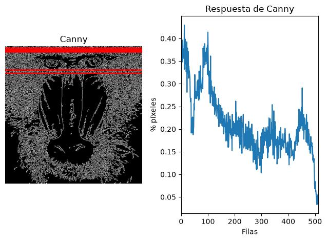
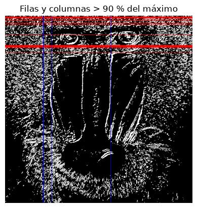
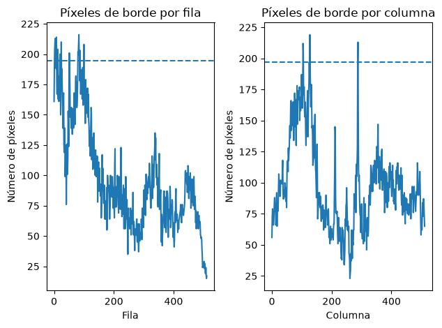
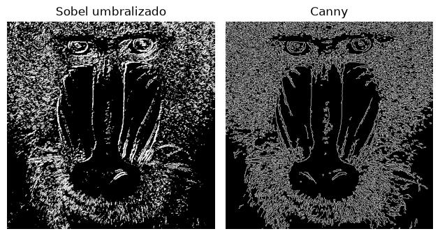
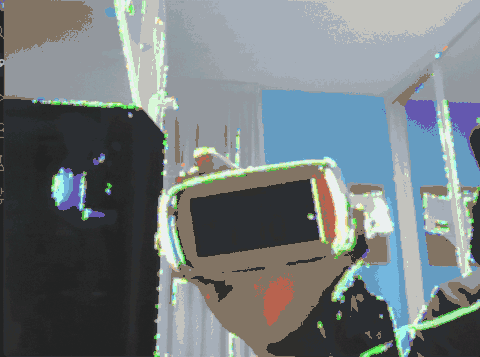

# Práctica 2 - Funciones básicas de OpenCV

Este repositorio contiene la segunda práctica de la asignatura Visión por Computador, llamada **Funciones básicas de OpenCV**. El trabajo realizado hasta ahora se encuentra en el cuaderno `VC_P2.ipynb`, usando Python, OpenCV, NumPy y Matplotlib para cargar imágenes, convertir espacios de color, detectar bordes, aplicar umbralizados y analizar la distribución de píxeles en imágenes binarias.

## Autores

- [Pablo Llopis Parrilla](https://github.com/Putrici0)
- [David González Espino](https://github.com/002avid)

## Contenido del repositorio

- `VC_P2.ipynb`: cuaderno principal donde se desarrolla la práctica y se encuentran las distintas tareas realizadas.
- `mandril.jpg`: imagen utilizada para las pruebas.
- `resultados/`: carpeta que contiene las imágenes generadas durante la práctica.
  - `canny_filas.jpg`: resultado del análisis por filas sobre la imagen obtenida mediante Canny.
  - `sobel_filas_columnas.jpg`: filas y columnas que alcanzan al menos el 90 % del máximo sobre la imagen de Sobel umbralizada.
  - `sobel_graficas.jpg`: gráficas del número de píxeles de borde encontrados por filas y columnas.
  - `sobel_vs_canny.jpg`: comparación visual entre los resultados obtenidos mediante Sobel umbralizado y Canny.

## Instalación y ejecución

No se necesita instalar nada adicional respecto al entorno indicado en el [README de la práctica original proporcionada por el profesor](https://github.com/otsedom/otsedom.github.io/blob/main/VC/P2/README.md). Con ese entorno es suficiente para ejecutar el cuaderno.

El cuaderno trabaja con la imagen `mandril.jpg`, que debe estar en el mismo directorio que `VC_P2.ipynb`. Para las partes que usan la cámara, el equipo debe tener una webcam disponible y permisos para acceder a ella. La salida de cámara se cierra pulsando ESC.

## TAREA: cuenta de píxeles blancos por filas en Canny

En esta tarea se parte de la imagen `mandril.jpg`, que se carga con `cv2.imread()` y se convierte a escala de grises mediante `cv2.cvtColor()`. Esta conversión es necesaria porque Canny trabaja sobre la intensidad de la imagen, no sobre los tres canales BGR por separado. Sobre esta imagen se aplica el detector de bordes Canny utilizando `cv2.Canny(gris, 100, 200)`.  Los valores `100` y `200` son los dos umbrales del proceso de histéresis de Canny. El umbral alto, `200`, marca como bordes seguros los píxeles con un gradiente suficientemente fuerte. El umbral bajo, `100`, permite conservar píxeles más débiles solo si están conectados a esos bordes fuertes.

El objetivo es contar los píxeles blancos presentes en cada fila de la imagen obtenida con Canny. Para ello se utiliza `cv2.reduce(canny, 1, cv2.REDUCE_SUM, dtype=cv2.CV_32SC1)`, que reduce la imagen sumando los valores de cada fila. El parámetro `1` indica que la reducción se hace por filas, `cv2.REDUCE_SUM` especifica que la operación aplicada es una suma y `CV_32SC1` evita problemas de desbordamiento al acumular muchos valores de píxeles. Como la imagen de Canny es binaria y contiene valores 0 para el fondo y 255 para los bordes, estas sumas permiten conocer la cantidad de píxeles pertenecientes a bordes que existen en cada fila. Para obtener el número real de píxeles blancos, la suma de cada fila se divide entre 255.

A partir de estos valores se obtiene `maxfil`, que representa el máximo número de píxeles blancos encontrados en una misma fila. Se seleccionan posteriormente aquellas filas que contienen al menos el 90 % de dicho máximo.

En la ejecución realizada se obtiene:

- Máximo de píxeles blancos en una fila: **220**.
- Filas que alcanzan al menos el 90 % del máximo: **6, 12, 15, 20, 21, 88 y 100**.
- Número total de filas seleccionadas: **7**.

### Resultado

Para visualizar el resultado, se dibujan líneas horizontales rojas sobre las filas seleccionadas en la imagen obtenida mediante Canny. Junto a ella se representa la proporción de píxeles blancos encontrada en cada fila.

Los valores más altos de la gráfica corresponden a las filas en las que Canny ha detectado una mayor concentración de píxeles pertenecientes a bordes. Estas filas son las que aparecen resaltadas en rojo sobre la imagen.

## Ampliación

## TAREA: umbralizado de Sobel y conteo por filas y columnas

En esta tarea se utiliza el operador Sobel para detectar cambios de intensidad en la imagen. Antes de aplicar Sobel, la imagen en escala de grises se suaviza mediante un filtro gaussiano. Posteriormente se calculan las derivadas horizontal y vertical y se combinan para obtener la imagen de bordes.

Como el resultado de Sobel contiene valores positivos y negativos, se convierte a una imagen de 8 bits mediante `cv2.convertScaleAbs()`. Sobre esta imagen se aplica posteriormente un umbral de valor **100**, obteniendo una imagen binaria en la que los píxeles pertenecientes a los bordes tienen valor 255 y el resto valor 0.

A partir de esta imagen se utiliza `np.count_nonzero()` para contar el número de píxeles blancos presentes en cada fila y columna. Después se seleccionan aquellas filas y columnas que contienen al menos el 90 % del máximo correspondiente.

En la ejecución realizada se obtiene:

- Máximo de píxeles por fila: **216**.
- Máximo de píxeles por columna: **219**.
- Filas por encima del 90 % del máximo: **2, 3, 4, 5, 8, 11, 12, 19, 20, 24, 51, 80, 81, 82, 83, 84, 85, 87 y 100**.
- Columnas por encima del 90 % del máximo: **104, 105, 127 y 288**.

### Resultado

Para visualizar las posiciones seleccionadas se dibujan líneas horizontales rojas sobre las filas y líneas verticales azules sobre las columnas que alcanzan al menos el 90 % de sus respectivos valores máximos.

También se representa el número de píxeles blancos encontrado en cada fila y columna. La línea discontinua indica en ambos casos el umbral correspondiente al 90 % del máximo.

### Comparación con Canny

Finalmente, se comparan visualmente los bordes obtenidos mediante Sobel umbralizado y Canny.

Sobel, después del umbralizado, produce bordes generalmente más gruesos y una mayor cantidad de píxeles activados, ya que responde directamente a los cambios de intensidad de la imagen y el resultado depende del umbral seleccionado.

Canny, en cambio, produce bordes más finos y definidos al incluir etapas adicionales como el suavizado, la supresión de no máximos y el doble umbral con histéresis. En esta imagen se puede observar cómo Canny ofrece una representación más selectiva de los bordes, mientras que Sobel resalta una mayor cantidad de zonas.

## Ampliación

## TAREA: propuesta propia

## Ampliación

## Fuentes y herramientas utilizadas

- Repositorio completo de la práctica proporcionado por el profesor, usado como enunciado y referencia principal: https://github.com/otsedom/otsedom.github.io/tree/main/VC/P2
